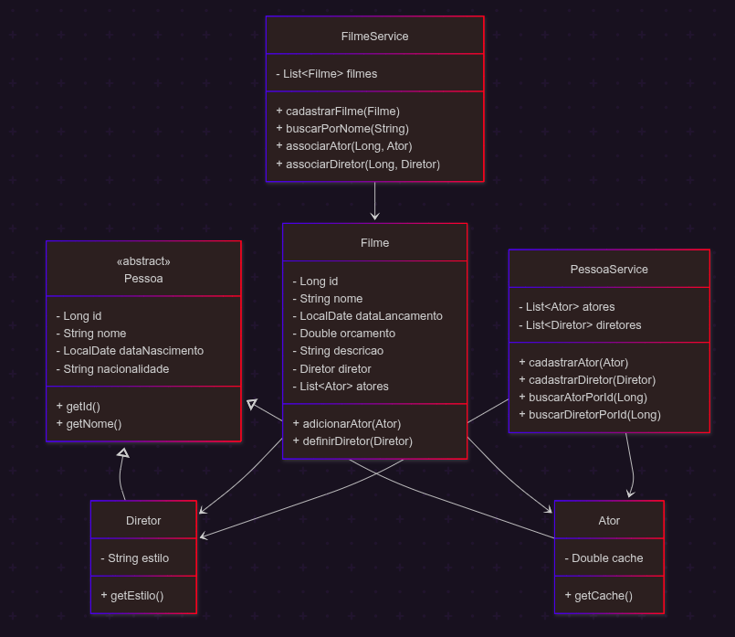
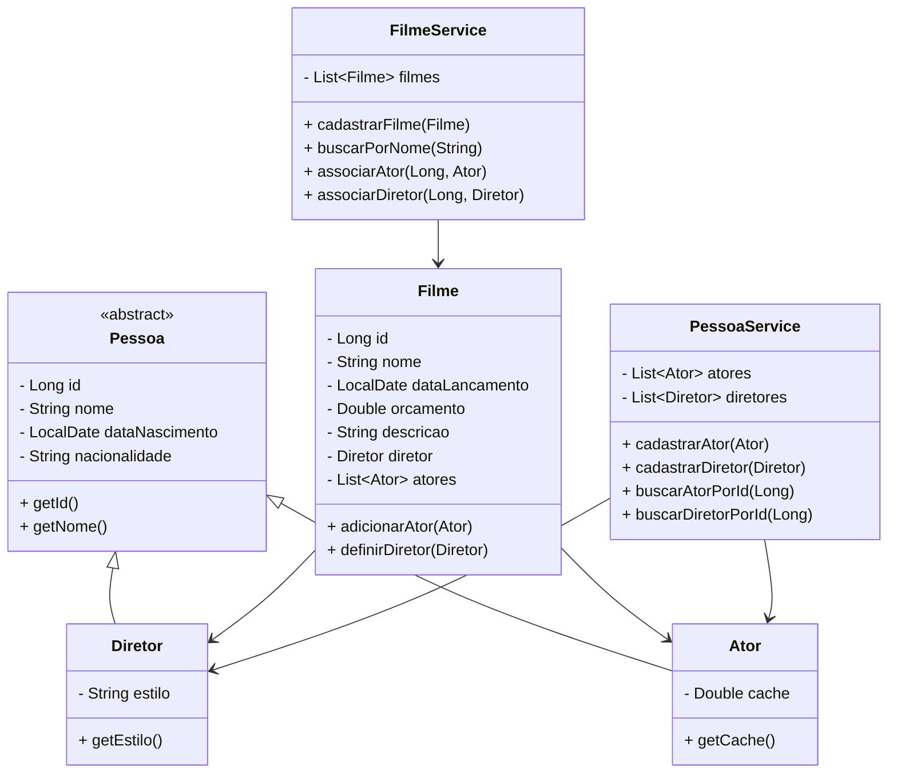

#  Sistema de Catálogo de Filmes (IMDB-like)

##  Descrição

Este projeto consiste no desenvolvimento de um sistema backend para gerenciamento de um catálogo de filmes, inspirado no IMDB, como parte da disciplina de POO do gragrama ADA/Nuclea Java Backend.

A aplicação permite:

* Cadastro de filmes
* Cadastro de atores e diretores
* Associação de atores e diretores aos filmes
* Busca de filmes por nome (ignorando maiúsculas/minúsculas)

O sistema foi desenvolvido utilizando conceitos de **Programação Orientada a Objetos (POO)**:

* Encapsulamento
* Herança
* Polimorfismo
* Classes Abstratas

---

##  Diagrama UML



---

## Conceitos de POO Aplicados

###  Encapsulamento

Atributos privados com acesso controlado via getters e setters.

### Herança

* `Pessoa` é uma classe abstrata
* `Ator` e `Diretor` herdam de `Pessoa`

###  Polimorfismo

Permite tratar `Ator` e `Diretor` como `Pessoa`.

###  Abstração

A classe `Pessoa` define características comuns.

---

## 🔍 Funcionalidade de Busca

A busca de filmes é feita ignorando letras maiúsculas/minúsculas:

```java
public List<Filme> buscarPorNome(String nome) {
    return filmes.stream()
        .filter(f -> f.getNome().toLowerCase()
        .contains(nome.toLowerCase()))
        .toList();
}
```

---

##  Estrutura do Projeto

```
src/
 ├── model/
 │    ├── Pessoa.java
 │    ├── Ator.java
 │    ├── Diretor.java
 │    └── Filme.java
 │
 ├── service/
 │    ├── FilmeService.java
 │    └── PessoaService.java
 │
 ├── repository / (desenvolvido mais a frente)
 │
 └── controller/ (desenvolvido mais a frente)
```

---

##  Colaboração

Projeto desenvolvido em grupo ( 4 integrantes).


## Possíveis Melhorias que não foram implementadas:

* Sistema de avaliação de filmes 
* API REST com Spring Boot
* Integração com banco de dados (H2, PostgreSQL)
* Interface web (React)

---

## Tecnologias envolvidas

* Java
* Git e GitHub


---

##  Objetivo Acadêmico

Este projeto tem como objetivo consolidar os conceitos de POO na prática, simulando um sistema real de catálogo de filmes.

---
